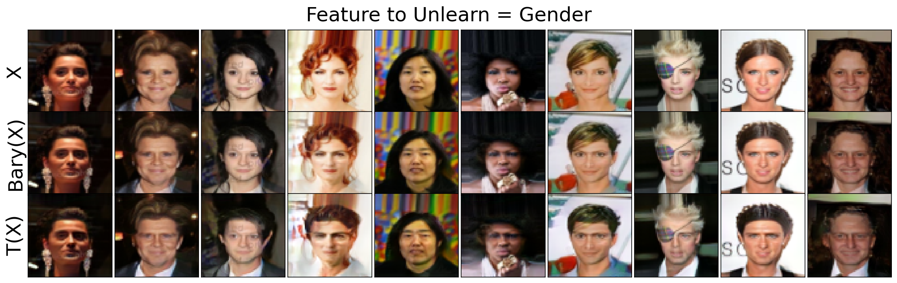
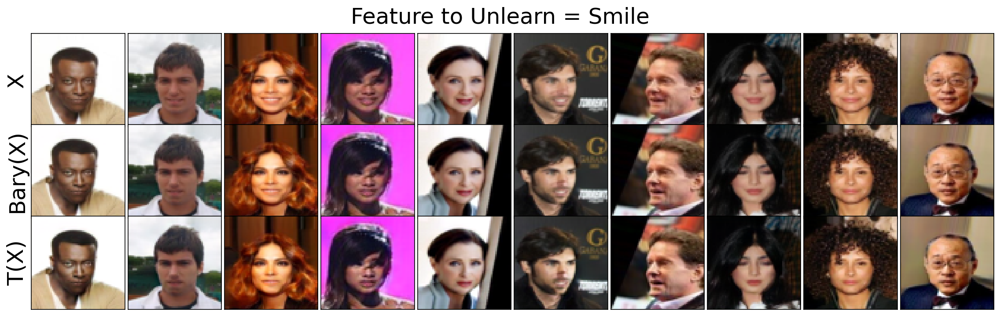
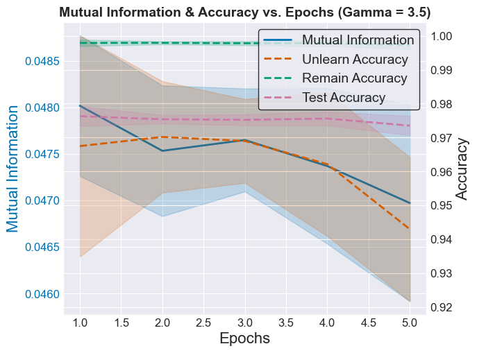
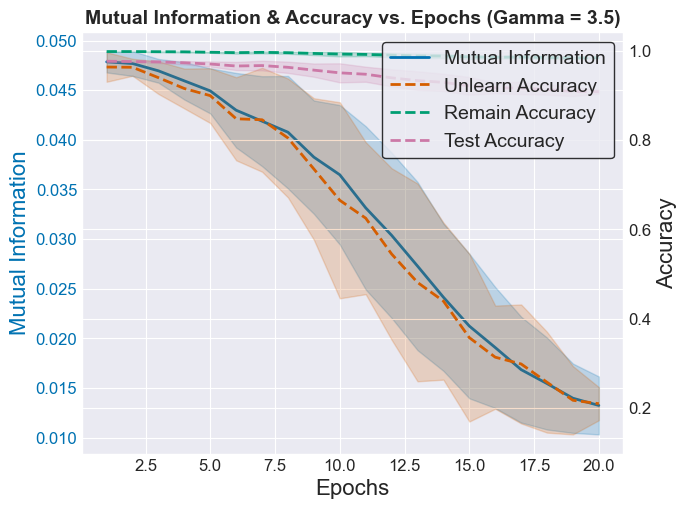
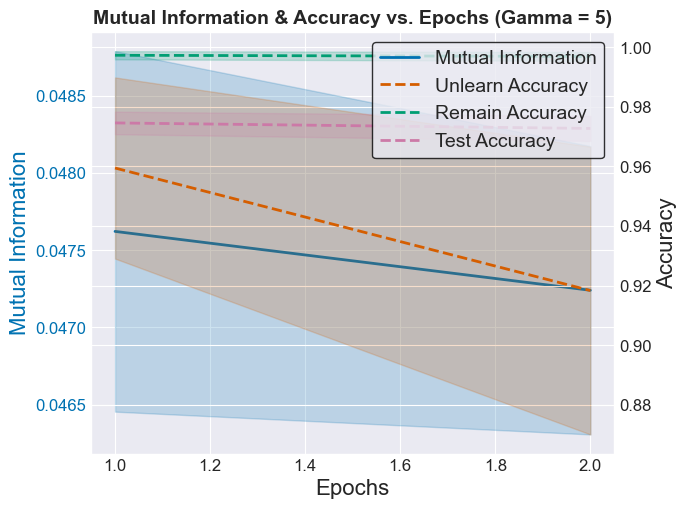
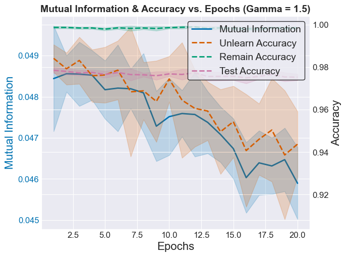

# Machine Unlearning via Information Theoretic Regularization

[](https://opensource.org/licenses/MIT)
[](https://www.python.org/)

## Overview

This repository serves as the **official hub** for research and development on **Machine Unlearning via Information-Theoretic Regularization**, an approach designed to **remove the marginal effects of specific features or data points while preserving model utility**. The proposed framework is **method-agnostic** and provides a unified perspective on unlearning through **optimal transport and information-theoretic constraints**.

We welcome **collaborations, discussions, and contributions** to advance this framework and explore its integration into open-source libraries.

### Why This Framework?
- **A Unified Theoretical Perspective on Model Unlearning**: Built on **information-theoretic regularization**, ensuring rigorous, verifiable, and tractable guarantees for unlearning while maintaining utility.
- **Adjustable Unlearning Speed**: Balance unlearning speed and stability by tuning the regularization parameter based on the urgency of the unlearning task.
- **Flexibility in Learning Objective**: The proposed framework integrates a regularization term into the original training objective without altering it.
- **Multipurpose Direct Feature Unlearning**: Enables direct feature unlearning **at the data level** while maximizing retained information for **general downstream tasks**, without requiring predefined target variables.
- **Open-Source Collaboration**: Contributions are encouraged for both theoretical advancements and practical implementations.

### Examples

1. **Feature Unlearning**

   In this example, we demonstrate how specific features can be unlearned from the data:
   
   - **Gender Unlearning**: This example shows the unlearning of gender-related features. The figure below illustrates the effect of removing gender information from the model.
   
     
   
   - **Smile Unlearning**: This example demonstrates how smile-related features are unlearned. The plot below visualizes the results after the smile feature has been removed.
   
     

2. **Data Points Unlearning**

   In the data points unlearning example, we fix two-thirds of the MNIST data with digit label 3 as the subset that the classifier tries to unlearn, and we monitor changes in mutual information and prediction accuracy on the following datasets:
   1. The remaining training dataset
   2. The unlearning dataset
   3. The testing dataset

<table>
  <tr>
    <td></td>
    <td></td>
  </tr>
  <tr>
    <td></td>
    <td></td>
  </tr>
</table>

To run this experiment, simply execute the Python file containing the implementation:
```bash
python mnist_unlearning.py
```
1. Mutual information and model utility on the MNIST unlearning dataset exhibit a strong correlation, allowing tractabel unlearning rate by monitoring mutual information.
2. The rate of utility reduction can be precisely controlled by adjusting the regularization parameter gamma, enabling adjustable unlearning speeds while maintaining accuracy. But we also note there exists a trade-off between the unlearning speed and unlearning stability: large(small) gamma leads to faster(slower) unlearning but less(more) stability in the unlearning performance.
3. Lastly, we note that the re-training from scratch model often coincide with the proposed unlearning when the model test accuracy starts to drop.


---

## 🤝 How to Get Involved

We invite **researchers, developers, and practitioners** to collaborate in the following areas:  

1. **Implementing Multipurpose Feature Unlearning on Data** using Wasserstein Barycenters.  

2. **Enhancing Data Point Unlearning** by improving information-theoretic regularization to better penalize the marginal effects of adding or removing data points.  

3. **Exploring Alternative Regularizations** to refine unlearning performance beyond mutual information, tailored to specific learning objectives.  

4. **Benchmarking & Evaluation**: Comparing against existing unlearning approaches (e.g., amnesic unlearning) and testing against adversarial attacks (e.g., membership inference attacks) on datasets of various scales.  

5. **Precise Estimation of Retraining from Scratch**: Investigating the correlation between mutual information and utility to refine regularization parameter tuning and improve retraining estimation accuracy.  

6. **Open-Source Integration**: Expanding the framework into scikit-learn, `TorchUnlearn`, and other ML libraries.  

If you're interested in contributing, please **open an issue** or **start a discussion** on GitHub.  
For specific research inquiries, feel free to reach out: **Shizhou Xu**.

---

## The Proposed Framework

The framework formulates **feature unlearning** and **data point unlearning** as **optimization problems** with information-theoretic constraints:

- **Multi-Purpose Feature Unlearning on Data (Optimal Transport-Based):**

```math
  \sup_{f: \mathcal{X} \times \mathcal{Z} \rightarrow \mathcal{X}} \mathcal{U}(X; \hat{X}) \quad \text{subject to} \quad \hat{X} \perp Z
```

  where $\hat{X}$ is the transformed dataset that retains utility while removing unwanted feature information.

- **Data Point Unlearning (Mutual Information-Based):**

```math
\sup_{f: \mathcal{X} \rightarrow \mathcal{Y}} \mathcal{U}(Y; \hat{Y}) - \gamma I(\hat{Y}_{train}; Z)
```
  
  where the goal is to balance utility preservation with data point removal using soft independence constraints.
  
---

## 📦 Installation (Coming Soon)

The repository will host modular implementations for:
- Wasserstein Barycenters (Feature Unlearning)
- Mutual Information Regularization (Data Point Unlearning)
- Synthetic and Real-World Dataset Experiments

For now, **stay updated** by starring this repository ⭐ and following our progress.
